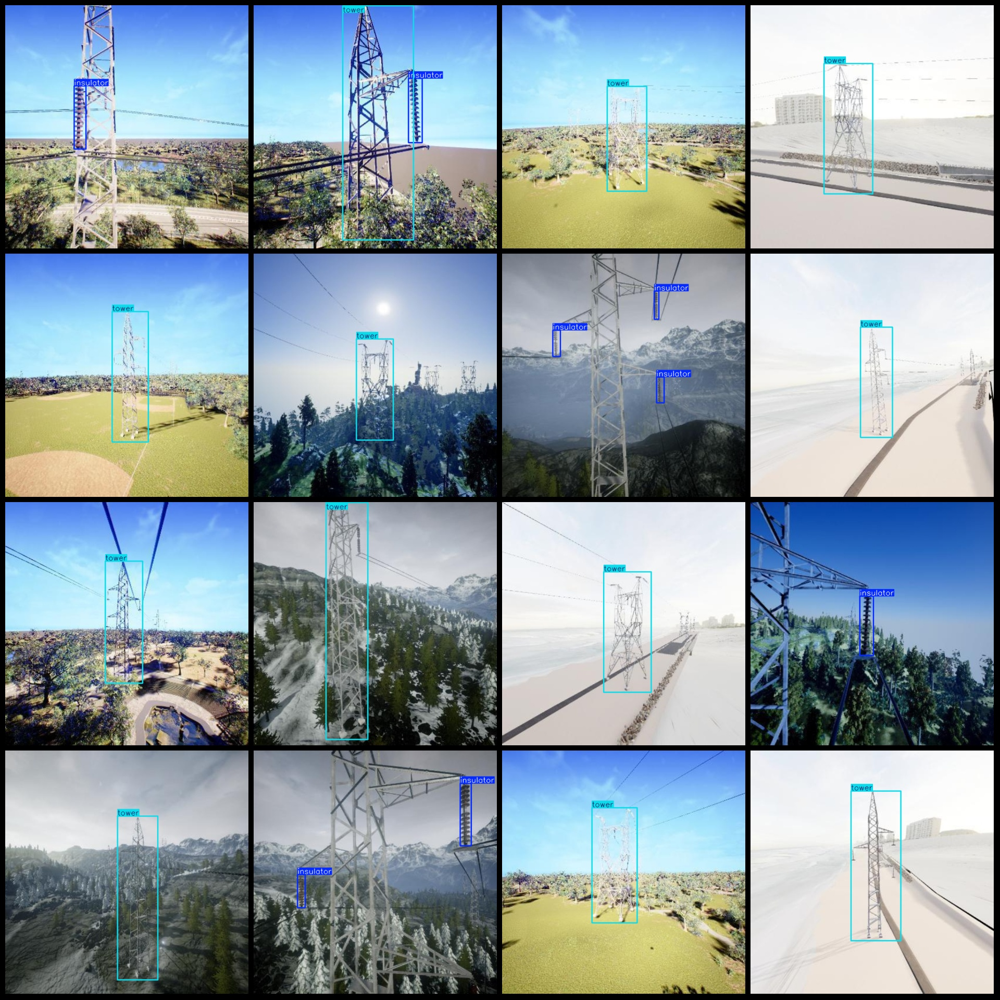
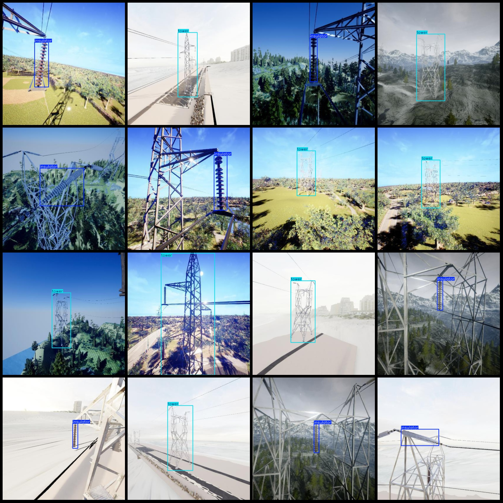
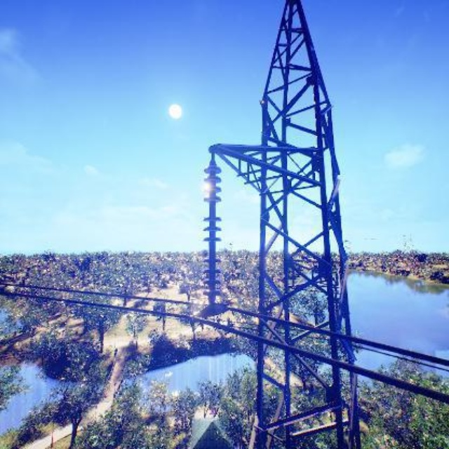
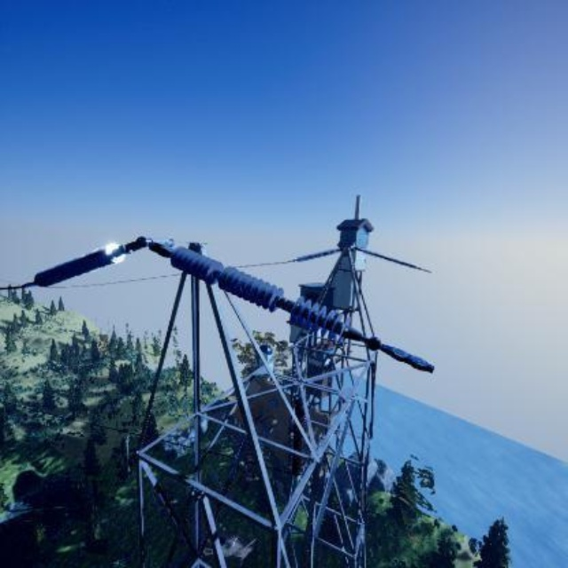

# Power Scene Insulator and Transmission Tower Detection Dataset (VOC+YOLO Format, 2022, 2-class)

Note: The images are not very clear in general. Please refer to the image preview and example images for details.

Dataset format: Pascal VOC format + YOLO format (txt file without split path, only containing jpg images and corresponding VOC format xml files and yolo format txt files)

Number of images (jpg file count): 2022
Number of annotations (xml file count): 2022
Number of annotations (txt file count): 2022
Number of annotation categories: 2
Annotation category names (notice that the order of yolo format categories does not match this, but is based on the labels folder 'classes.txt'): ["insulator", "tower"]
Number of bounding box instances per category:
- "insulator" bounding box instances = 1159
- "tower" bounding box instances = 1090
Total bounding box instances: 2249
Number of images each category occupies:
- "insulator" occupies images = 984
- "tower" occupies images = 1065
Image resolution: 640x640
Annotation tool used: labelImg
Annotation rules: draw bounding boxes for each category
Important note: The dataset does not have been split into training, validation, or test sets; you need to do so yourself.
Special declaration: This dataset does not guarantee the accuracy of the trained model or weight files.
Image preview:
Annotation examples:
Original image display:

## Images

Here is a pay link on Stripe ( https://buy.stripe.com/3cs8yP7sY87d0vu9AB ). Please contact me lonlonago@foxmail.com after funding $89, and I will send you a complete data files , thank you!

